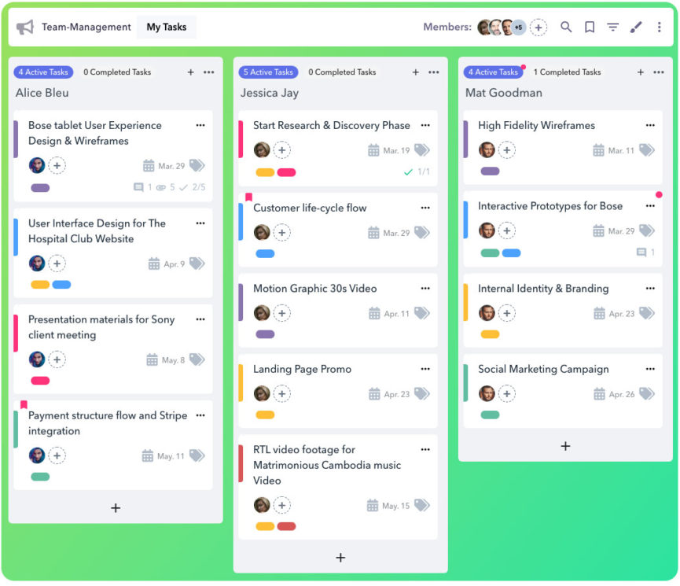
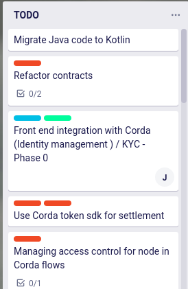

# Task Board

Task board is a tool that lets us create a list of tasks and showcases the status of 
each task on a dashboard to track the status of each task. 

Design and develop and a task board with basic functionality as mentioned below.

## 1. Create a task board dashboard

Design a dashboard with basic functionality similar to [trello.com](https://trello.com).

The dashboard design should have the following features

* 4 columns (TODO, DOING, DONE and REJECTED) to represent the status of each task

    
   
* A button to create a new task that pops up onclick. The created task should be moved to the first column by default.

> NOTE: Multiple tasks can exist on the same column:
  

* The tasks created can be moved (dragged and dropped) to any of the columns to change the status

    > NOTE: You can use any of the modules that provides drag and drop functionality
     Few of the modules you may use in React are:
     * [react-beautiful-dnd](https://github.com/atlassian/react-beautiful-dnd/)
     * [react-dnd](https://github.com/react-dnd/react-dnd)
     * [react-sortable-hoc](https://github.com/clauderic/react-sortable-hoc)
     
## 2. Make the status changes persistent

* When a new task is created or the task changes its status by moving it to a different column, store the task and status in the [localstorage](https://developer.mozilla.org/en-US/docs/Web/API/Window/localStorage) so that changes are persistent. 

* You can also provide a delete option for the tasks if it needs to be removed from the localstorage

## 3. Store and fetch the tasks from a server application(optional)

* Create a server side logic to store and fetch the task details

> NOTE: You can use any of the server side programming languages/ framework (Python, Node, Java, Ruby ..) to build the server side application

* The server side application may contain APIs to:
    
    * Store and fetch the tasks
    * Update the status of the task
    
* Server side application may use any of the databases to store the tasks

> NOTE: 
> * You can use any of the frontend frameworks (React, Angular, Vue of Vanilla JS) to build the application (**Using React is a bonus**)
> * The application source code should be committed using Git and pushed to a public repo (Preferably GitHub) 
> * Make sure to add proper build instructions for the application
> * You can also host the application on a server (optional)
> * Submit the application details in this [form](https://forms.gle/yf2MguhgZR9Jp7nCA) : https://forms.gle/yf2MguhgZR9Jp7nCA

