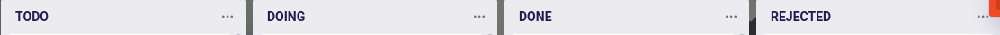

# Task Board

Task board is a tool that lets create a list of tasks and showcases the status of 
each task on a dashboard to track the status of each task. 

Design and develop and a task board with basic functionality as mentioned below.

## 1. Create a task board dashboard

Design a dashboard with basic functionality similar to [trello.com](https://trello.com).

The dashboard design should have the following features

* 4 columns (TODO, DOING, DONE and REJECTED) to represent the status of each task

    
   
* A button to create a new task that pops up onclick. The created task should be moved to the first column by default.

> NOTE: Multiple tasks can exist on the same column:
  

* The tasks created can be moved (dragged and dropped) to any of the columns to change the status

    > NOTE: You can use any of the modules that provides drag and drop functionality
     Few of the modules in React are:
     * [react-beautiful-dnd](https://github.com/atlassian/react-beautiful-dnd/)
     * [react-dnd](https://github.com/react-dnd/react-dnd)
     * [react-sortable-hoc](https://github.com/clauderic/react-sortable-hoc)
     
## 2. Make the status changes persistent

* When the task is changes its status by moving it to a different column, store the status in the [localstorage](https://developer.mozilla.org/en-US/docs/Web/API/Window/localStorage) so changes are persistent. 

* You can also provide a delete option for the tasks if it needs to be removed from the localstorage

## 3. Store and fetch the tasks in backend (optional)

